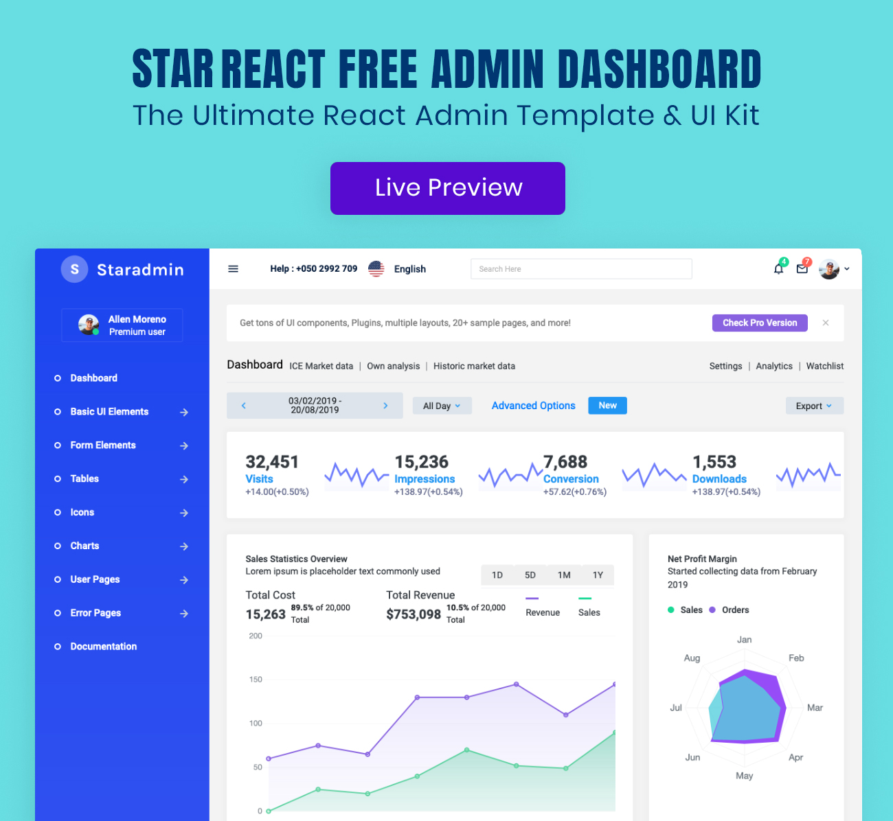

<h1>Star Admin Free React Template</h1>
Star Admin React is yet another incredible admin template from BootstrapDash that is based on Bootstrap framework. The template is tastefully designed and coded to perfection. Star Admin React comes packed with a lot of bootstrap components, UI elements and built-in sample pages to kick-start your project.
  
The template is highly customizable so that you can alter the design to suit your needs and give it a unique look and very well-documented to help you get started without any issues.

<h1>Credits:</h1>

- Bootstrap
- Material Design Icons
- React
- Chart.js

<h1>Browser Support:</h1>

Star Admin React is designed to work flawlessly with all the latest and modern web browsers.

- Chrome (latest)
- FireFox (latest)
- Safari (latest)
- Opera (latest)
- IE10+  

<h1>License Information:</h1>

Star Admin React is released under MIT license. Star Admin React is a free react admin template developed by BootstrapDash. Feel free to download it, use it, share it, and get creative with it.

<h1>How to use Star Admin React?</h1>

1 - Click the Clone or Download button in GitHub and download as a ZIP file or you can enter the command git clone https://github.com/BootstrapDash/StarAdmin-Free-React-Admin-Template.git in you terminal to get a copy of this template.

2 - After the files have been downloaded you will get a folder with all the required files

3 - You can install all the dependencies in the template by running the command 'npm install'. All the required files are in the node modules.

4 - You can serve the template with the command 'npm start'.

5 - Now that your project has now kick-started, all you need to do now is to code, code, and code to your heart's content.

<h1>How to Contribute?:</h1>

We love your contributions and we welcome them wholeheartedly. We believe the more the merrier.
To contribute make sure you have a Node.js and npm installed.

<h2>Next</h2>

After node and npm has been installed, follow the steps below to contribute.
   
	1 - Fork and clone the repo of Star React Admin.
   
	2 - Run the command 'npm install' to install all the dependencies.
   
	3 - Enter the command 'npm start'. This will open Star React Admin in your default browser.
   
	4 - Make your valuable contribution
   
	5 - Submit a pull request.
  

	Do you need a template with more features and functionalities? Get more with our collection of the premium template with more plugins, eye catching animations, UI components, and sample pages all fitting together with a high-quality design.
Visit
  <a href="https://www.bootstrapdash.com" target="_blank">https://www.bootstrapdash.com</a> for more admin templates.
